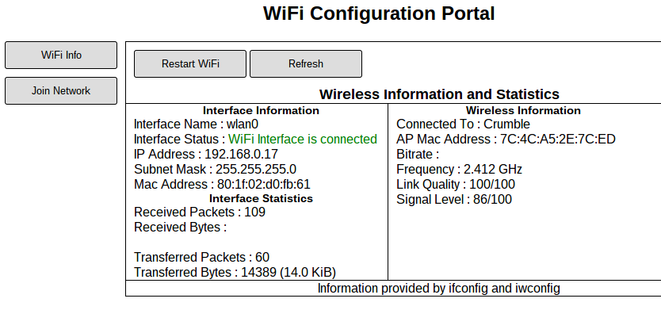

raspap-webgui
=============




Started and modified from here (http://sirlagz.net/2013/02/08/raspap-webgui/)
Modified and put on github by: https://github.com/rjpcomputing/raspap-webgui

Readme edited to use as web-config for connecting to WIFI networks not creating an access point 

Requirements
============
A raspberry pi with raspbian running on it. You will need to ssh into it to set this up.

The Packages required for the WebGUI are:
* lighttpd
* php5-cgi
* git

Steps
=====


```
  $ sudo apt-get install lighttpd php5-cgi
  $ sudo lighty-enable-mod fastcgi-php
  $ sudo service lighttpd force-reload
```

For security reasons, the www-data user which lighttpd runs under is not allowed to start or stop daemons, or run commands like ifdown and ifup, all of which I wanted my page to do.
So what I have done, is added the www-data user to the sudoers file, but with restrictions on what commands the user can run.
The line appears in /etc/sudoers like this –


 `$ sudo visudo`

add: 
```
www-data ALL=(ALL) NOPASSWD:/sbin/ifdown wlan0,/sbin/ifup wlan0,/bin/cat /etc/wpa_supplicant/wpa_supplicant.conf,/bin/cp /tmp/wifidata /etc/wpa_supplicant/wpa_supplicant.conf,/sbin/wpa_cli scan_results,/sbin/wpa_cli scan,/bin/cp /tmp/hostapddata /etc/hostapd/hostapd.conf,/etc/init.d/hostapd start,/etc/init.d/hostapd stop,/etc/init.d/dnsmasq start,/etc/init.d/dnsmasq stop,/bin/cp /tmp/dhcpddata /etc/dnsmasq.conf
```

```
  $ cd /var/www
  $ sudo git clone https://github.com/glynhudson/raspap-webgui.git
  $ cd raspap-webgui
  $ sudo cp * /var/www
  $ sudo chown -R www-data:www-data /var/www
```
Add wifi check script to run every 5 min to check wifi is connected. 

BY DEFAULT WIFI WILL ONLY CONNECT IF ETHERENT IS DISCONNECTED

```
  $ sudo cp /var/www/wifi-check /usr/local/bin/wifi-check
  $ sudo chmod +x /usr/local/bin/wifi-check
  $ sudo crontab -e
```  
add:

  `$  */5 * * * * /usr/local/bin/wifi-check > /tmp/wificheck.log 2>&1`
  
  `$ sudo reboot`
